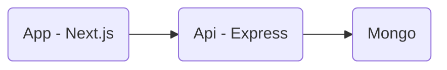

# Url shortener

A simple url shortener, similar to bit.ly. 

The frontend is built using Next.js, and React Query for state management.

The backend is an Express.js app that uses MongoDB for storage.



## Prerequisites

Install [Docker Desktop](https://docs.docker.com/get-docker) for Mac, Windows, or Linux. Docker Desktop includes Docker Compose as part of the installation.

## Development

Run the development server:

```bash
# Create a network, which allows containers to communicate
# with each other, by using their container name as a hostname
docker network create url-shortener

# Build dev using new BuildKit engine
docker compose -f docker-compose.dev.yml build

# Up dev
docker compose -f docker-compose.dev.yml up
```

Open [http://localhost:3000](http://localhost:3000) with your browser to see the result.

Api Service runs on [http://localhost:3001](http://localhost:3001)

Insomnia file included int api/insomnia/insomnia.json for manual testing of the API and responses.

Mongo express will run on [http://localhost:8081](http://localhost:8081)


## Next Steps / Improvements

- [] Setup e2e tests with Cypress
- [] Improve error handling states on front end.
- [] Add loading states for form and recent urls list.
- [] Handle urls that are missing protocols a bit better to improve UX.
- [] Optimise sequence generation in the API e.g. get next 1k.
- [] Investigate migrating to use new Next.js sever components.
- [] Add package for allow code sharing between App/API
- [] Add OpenAPI spec which we can generate HTTP client from 
